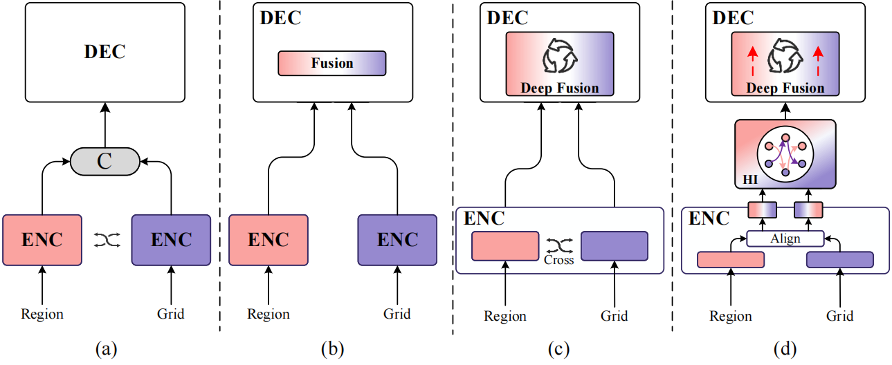
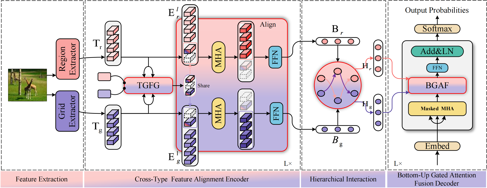
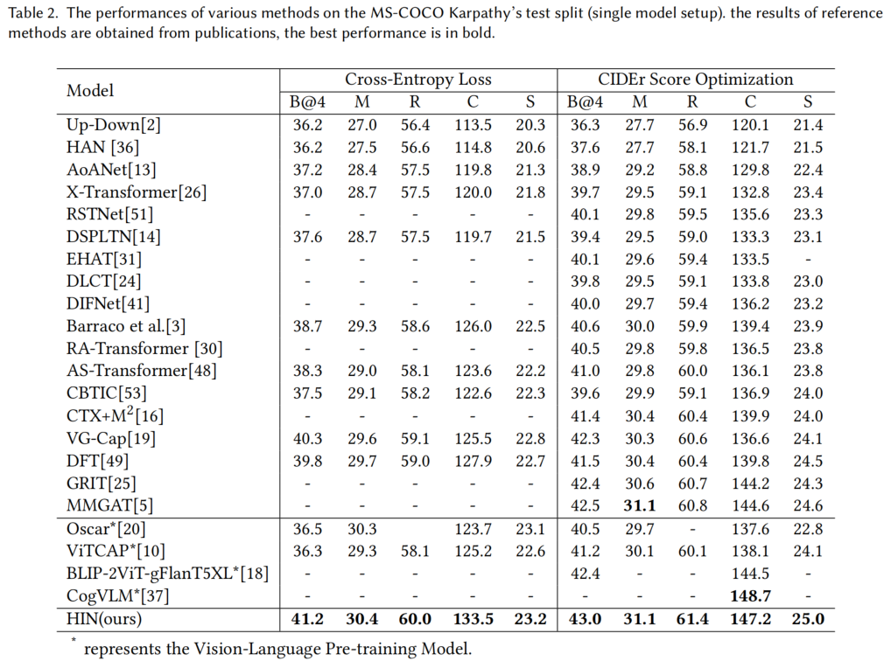
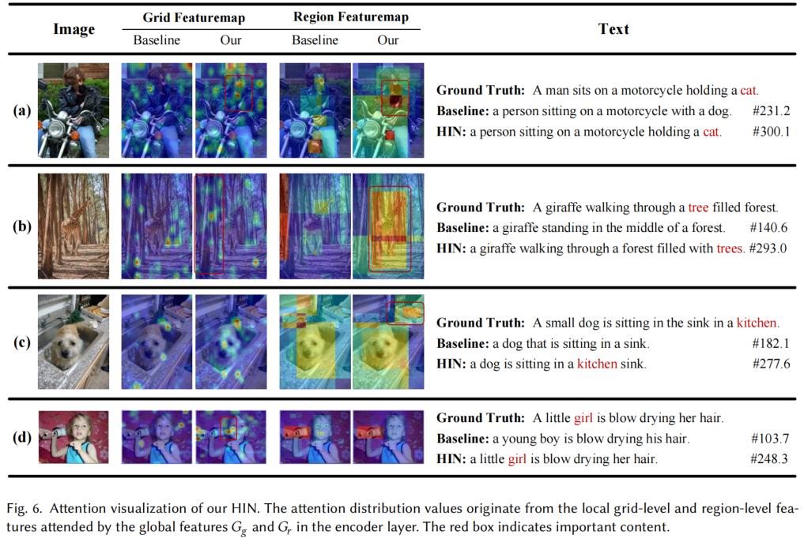

# HIN: Hierarchical Interaction Network for Image Captioning
Author: Chuanle Song et al.
This is the official repository for paper "HIN: Hierarchical Interaction Network for Image Captioning"

## Please share a STAR ⭐ if this project does help
<div align="center">
  
</div>
The purpose of the image captioning task is to understand the content of an image and generate corresponding descriptive text. Traditional approaches to image captioning typically generate descriptive text by extracting different types of visual features from an image and performing feature interactions. However, these methods often fail to fully exploit the interactions between different types of visual features, leading to suboptimal feature integration. To address this limitation, we propose a novel Hierarchical Interaction Network (HIN), designed to continuously extract and interact with different types of visual features to perform more effective multilevel feature interactions. Our HIN consists of three key modules: firstly, we design the Cross-Type Feature Alignment (CTFA) encoder, which aligns different types of visual features by three global features, so that the subsequent modules can effectively carry out the hierarchical interaction; secondly, the Hierarchical Interaction (HI) module, which utilizes different types of multilevel features output from the encoder to carry out feature interactions and information mining, so as to generate fully mined multilevel features. The Bottom-up Gated Attention Fusion (BGAF) decoder is finally designed to perform the multilevel decoding of the features mined by our HI module, further enhancing the feature interaction capabilities of our HIN. Moreover, additional experiments on the MS-COCO dataset show that our model achieves new state-of-the-art performance.
<div align="center">
  
</div>

## 1 Environment setup
Clone the repository and create the `HIN` conda environment:
```
conda create -n HIN python==3.8
conda activate HIN
```

Then download spacy data by executing the following command:
```
pip install spacy
python -m spacy download en
```


## 2 Data Download
### 2.1 Download data and prepare the directory structure as:
```
HIN
|-data
    |-annotations
    |-evaluation
    |-cache
    |-COCO2014_VinVL.hdf5
    |-COCO2014_VinVL_TEST.hdf5
    |-COCO2014_ViT-L-14.hdf5
    |-COCO2014_ViT-L-14_test.hdf5
    |-cache
    |-COCO
        |-train2024
        |-val2024
        |-test2024
```

Please download the data folder [data folder](https://pan.baidu.com/s/1B5SrjBz8vLoU6WZp_v8aHg?pwd=7qwb) (Extraction code: 7qwb ) and extract it.


## 3 Get started

### 3.1 parameters

Run `python train.py` using the following arguments:

| Argument | Possible values |
|------|------|
| `--output` | Output path|
| `--exp_name` | Experiment name|
| `--batch_size` | Batch size (default: 20) |
| `--workers` | Number of workers (default: 8) |
| `--warmup` | Warmup value for learning rate scheduling (default: 10000) |
| `--N_enc` | Number of encoder layers|
| `--N_dec` | Number of decoder layers|
| `--resume_last` | If used, the training will be resumed from the last checkpoint. |
| `--resume_best` | If used, the training will be resumed from the best checkpoint. |
| `--use_rl` | Whether to turn on reinforcement learning|
| `--clip_path` | CLIP grid feature path|
| `--vinvl_path` | VinVL region feature path|
| `--features_path` | Path to detection features file |
| `--annotation_folder` | Path to folder with COCO annotations |
| `--vocab_path` | Path to folder with vocab_cache |
| `--cider_cache_path` | Path to folder with cider_cache |


 
### 3.2 Train
```
python train.py --device cuda:1 --batch_size 20 --output checkpoints --exp_name HIN 
```

### 3.3 Test
```
python test.py --device cuda:1 --output checkpoints --exp_name HIN 
```

### 3.4 Evaluation
To reproduce the results reported in our paper, download the checkpoint file [HIN_best_test](https://pan.baidu.com/s/1KsoTPAOdSKJ0S0hY3VXkyg?pwd=dvwe) (Extraction code: dvwe).

## 4 Results and Visualization
### 4.1  Comparison of Different Methods.
<div align="center">
  
</div>

### 4.2 Qualitative Analysis.
<div align="center">
  
</div>

## Acknowledgements
Our code is based on ([DFT](https://github.com/weimingboya/DFT)). We sincerely appreciate their contributions and authors for releasing source codes.

## Contact
If you have any questions about this project, please feel free to contact songchle@mail2.sysu.edu.cn.
